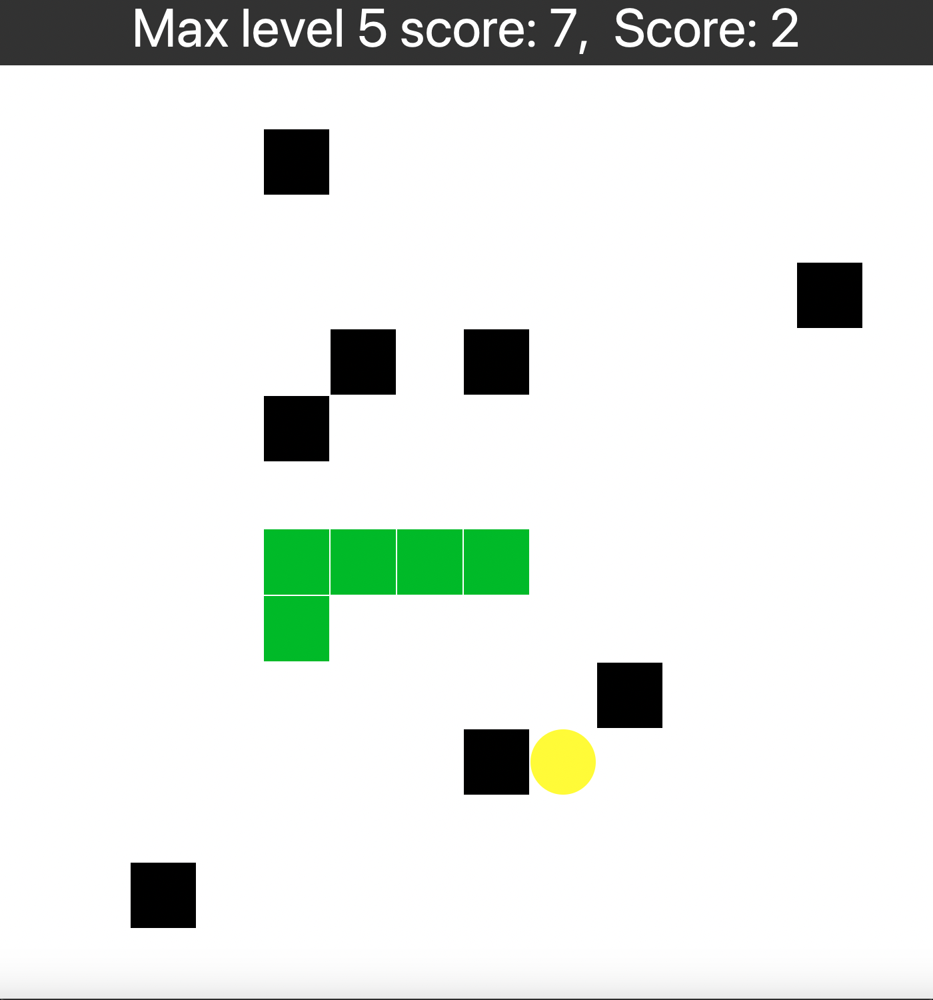

# Игра "Змейка"

Запуск: клонируйте этот репозиторий, зайдя в полученную папку, пропишите
```
./run.sh
```
Взаимодействие с приложением выполняется посредством нажатия клавиш на клавиатуре, сама змейка управляется с помощью нажатия на клавиши со стрелками.

В игре 5 видов "еды":
1) голубая - самое сильное замедление змейки
2) зеленая - обычное замедление змейки
3) желтая - не дает замедления/ускорения
4) оранжевая - обычное ускорение змейки
5) красная - самое сильное ускорение змейки

В игре 5 уровней:
1) обычная змейка, 3-й вид еды
2) змейка с 2-м, 3-м и 4-м видами еды
3) "Rush": 1-й и 5-й виды еды, которые чередуются между собой
4) змейка с 3-м видом еды, большое количество препятствий (новые препятствия не появляются)
5) змейка с 3-м видом еды, в начале небольшое количество препятсвий, но каждый раз, когда змейка ест еду, появляется новое препятствие

Кроме того, вне зависимости от уровня и типа еды, змейка ускоряется при увеличении ее длины.

Доступна таблица рекордов по каждому уровню: необходимо нажать 's' в момент, когда игра в приложении не активна.
